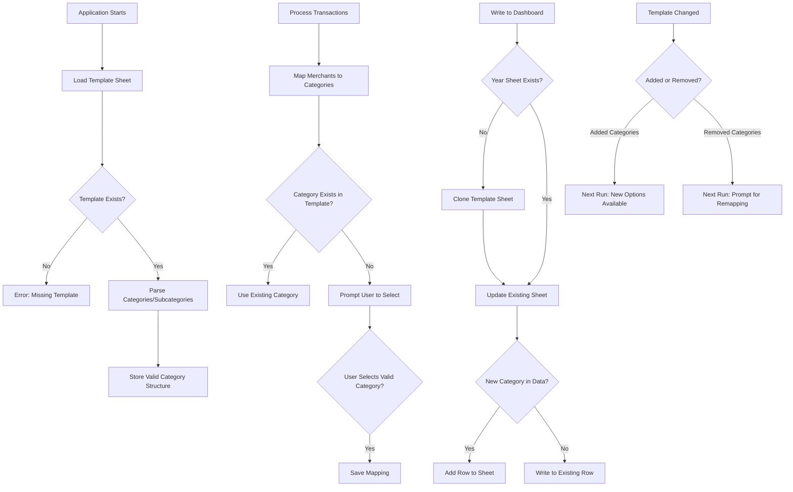

# Budget Tracker

**Budget Tracker** is a Python-based tool for processing, categorizing, and summarizing monthly financial transactions from Excel files.
It supports Hebrew-language inputs and outputs a categorized summary into a pre-designed Excel dashboard.

## Features

- **GUI Interface**: Easy-to-use graphical interface for importing and managing files.
- **Automated Processing**: Load and normalize Excel transaction files (`.xlsx`, `.xls`).
- **Smart Categorization**: Map merchants to user-defined budget categories and subcategories.
- **Dashboard Integration**: Output categorized monthly summaries into an existing formatted dashboard.
- **Backups**: Automatic backups of your dashboard, archived transaction files and temporary location for processing files.
- **Hebrew Support**: Built-in support for Hebrew text and date formats.

## Folder Structure

The application organizes your data in the `UserFiles` directory:
- `UserFiles/dashboard.xlsx`: Your main dashboard file.
- `UserFiles/categories.json`: Your saved category mappings.
- `UserFiles/backups/`: Automatic backups of dashboard, archives and temporary location for processing files.

## Usage

### GUI Mode (Recommended)
1. Run the application:
   ```bash
   python main.py --gui
   ```
2. **Import Files**: Drag & drop Excel files or use the "Import Files" button.
3. **Categorize**: The app will prompt you to map any new merchants.
4. **Update**: Review the summary and update your dashboard.

### CLI Mode
1. Place transaction files in `UserFiles/backups/`.
2. Run the script:
   ```bash
   python main.py
   ```
3. Follow the interactive prompts in the terminal.

## Setup

1. **Prerequisites**: Python 3.8+
2. **Install Dependencies**:
   ```bash
   pip install -r requirements.txt
   ```
3. **First Run**:
   - Ensure `UserFiles/dashboard.xlsx` exists and contains a sheet named `Template`.
   - The application will create necessary folders on first run.

## Template Sheet Overview

The **Template sheet** in `UserFiles/dashboard.xlsx` is the foundation of your Budget Tracker. It serves two critical purposes:

1. **Defines Valid Categories**: The Template sheet contains your category structure (Category | Subcategory) that the application uses to validate and map transactions.
2. **Layout Blueprint**: When processing transactions from a new year, the application clones the Template sheet to create year-specific sheets (e.g., "2024", "2025").

### Expected User Behavior

#### ✅ Adding Categories or Subcategories
When you add new categories or subcategories to the Template sheet:
- **No action required** - changes are detected automatically on the next run
- New options will appear in the category selection menu
- Missing rows will be automatically added to existing year sheets

#### ⚠️ Removing Categories or Subcategories
When you remove categories or subcategories from the Template sheet:
- **User intervention required** - the application detects conflicts with existing data
- You'll be prompted to remap any merchants that were previously assigned to the removed category
- Historical data is preserved; you simply reassign it to a valid category

#### 🔄 Reordering Rows
- **Completely safe** - the application uses category names, not row positions
- Reorder categories for better visual organization without affecting functionality

### Application Workflow



> **Important**: Never delete the Template sheet or rename it unless you also update the configuration in `code/config.py`.

## Upcoming Features

- **GUI Enhancements**
    - **Category Management**: Add a dialog to view, edit, and delete existing category mappings directly from the GUI.
    - **History View**: Add a tab to view a log of past imports and archived files.
    - **Advanced Charts**: Add interactive pie charts and trend lines to the dashboard view.

   - **Interactive Table Filtering**: Clicking a category row in the table (e.g., "רכב") should update the chart to show a breakdown of that category's subcategories or filter the chart to show that category's monthly trend.
   - **Budget Goals**: Set monthly limits per category and track progress.

- **Reporting & Export**
    - **PDF Reports**: Generate a printable monthly summary PDF.
    - **CSV Export**: Option to export the processed data to a clean CSV file.

- **Deployment**
    - **Executable Creation**: Use PyInstaller to bundle the application into a single `.exe` file for easy distribution without Python installation.

- **Bug Fixes & Maintenance**
    - **Test Coverage**: Increase unit test coverage for `gui_app.py`.
    - **Documentation**: Add docstrings to all GUI methods.

## License
This project is private and not intended for redistribution.
All rights reserved.