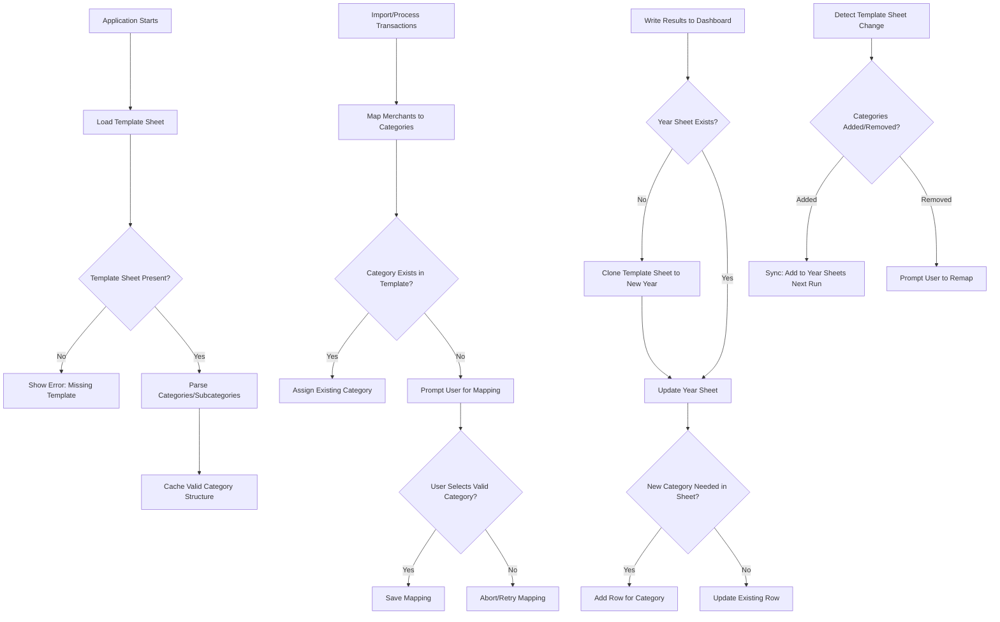

# Budget Tracker

**Budget Tracker** is a Python-based tool for processing, categorizing, and summarizing monthly financial transactions from Excel files.
It supports Hebrew-language inputs and outputs a categorized summary into a pre-designed Excel dashboard.

## Features

### Core Features
- **Modern GUI Interface**: Easy-to-use graphical interface with Hebrew/English support
- **Automated Processing**: Load and normalize Excel transaction files (`.xlsx`, `.xls`)
- **Smart Categorization**: Map merchants to user-defined budget categories and subcategories
- **Dashboard Integration**: Output categorized monthly summaries into an existing formatted dashboard
- **Backups**: Automatic backups of your dashboard, archived transaction files
- **Hebrew Support**: Built-in RTL support for Hebrew text and date formats

### File Management
- **Drag & Drop**: Import files by dragging them into the window
- **Duplicate Detection**: SHA256 hash-based detection prevents duplicate imports
- **File Preview**: See transaction count, date range, and total when selecting a file
- **Quick Delete**: Remove files with confirmation dialog
- **Folder Access**: One-click button to open archive folder

### Reporting & Export
- **Excel Dashboard**: Automatic updates with conflict resolution
- **Interactive Charts**: Click categories to filter and drill down

### User Experience
- **Dashboard Status**: Shows last update time ("2 hours ago", "yesterday")
- **Category Management**: Search, edit, and delete merchant mappings
- **Keyboard Shortcuts**: F5 (refresh), Ctrl+O (open dashboard), Ctrl+P (process), and more

## Screenshots

### Main Interface

*The main application window showing file list, dashboard summary table, and monthly expense chart*

### Category Management Dialog

*Search, edit, and manage merchant-to-category mappings*

## Folder Structure

The application organizes your data in the `UserFiles` directory:
- `UserFiles/dashboard.xlsx`: Your main dashboard file.
- `UserFiles/categories.json`: Your saved category mappings.
- `UserFiles/backups/`: Automatic backups of dashboard, archives and temporary location for processing files.

## Usage

### GUI Mode (Recommended)
1. Run the application:
   ```bash
   python main.py
   ```
   *(GUI starts by default)*

2. **Import Files**: 
   - Drag & drop Excel files into the window, OR
   - Click "Import Files" button to browse
   
3. **Preview Files**: Click on a file to see transaction count, dates, and total

4. **Process**: Click "Process Transactions" to start

5. **Categorize**: Map any new merchants to categories when prompted

6. **Review**: Check the summary table and charts

7. **Export**: Data is automatically saved to the dashboard. Click "Open Dashboard" to view in Excel.

### CLI Mode
1. Place transaction files in `UserFiles/backups/`
2. Run the script:
   ```bash
   python main.py --cli
   ```
3. Follow the interactive prompts in the terminal

## Setup

1. **Prerequisites**: Python 3.8+
2. **Install Dependencies**:
   ```bash
   pip install -r requirements.txt
   ```
3. **First Run**:
   - Ensure `UserFiles/dashboard.xlsx` exists and contains a sheet named `Template`.
   - The application will create necessary folders on first run.

## Template Sheet Overview

The **Template sheet** in `UserFiles/dashboard.xlsx` is the foundation of your Budget Tracker. It serves two critical purposes:

1. **Defines Valid Categories**: The Template sheet contains your category structure (Category | Subcategory) that the application uses to validate and map transactions.
2. **Layout Blueprint**: When processing transactions from a new year, the application clones the Template sheet to create year-specific sheets (e.g., "2024", "2025").

### Expected User Behavior

#### Adding Categories or Subcategories
When you add new categories or subcategories to the Template sheet:
- **No action required** - changes are detected automatically on the next run
- New options will appear in the category selection menu
- Missing rows will be automatically added to existing year sheets

#### Removing Categories or Subcategories
When you remove categories or subcategories from the Template sheet:
- **User intervention required** - the application detects conflicts with existing data
- You'll be prompted to remap any merchants that were previously assigned to the removed category
- Historical data is preserved; you simply reassign it to a valid category

#### Reordering Rows
- **Completely safe** - the application uses category names, not row positions
- Reorder categories for better visual organization without affecting functionality

### Application Workflow


```mermaid
graph TD
    A[Application Starts] --> B[Load Template Sheet]
    B --> C{Template Sheet Present?}
    C -->|No| D[Show Error: Missing Template]
    C -->|Yes| E[Parse Categories/Subcategories]
    E --> F[Cache Valid Category Structure]

    G[Import/Process Transactions] --> H[Map Merchants to Categories]
    H --> I{Category Exists in Template?}
    I -->|Yes| J[Assign Existing Category]
    I -->|No| K[Prompt User for Mapping]
    K --> L{User Selects Valid Category?}
    L -->|Yes| M[Save Mapping]
    L -->|No| N[Abort/Retry Mapping]

    O[Write Results to Dashboard] --> P{Year Sheet Exists?}
    P -->|No| Q[Clone Template Sheet to New Year]
    P -->|Yes| R[Update Year Sheet]
    Q --> R
    R --> S{New Category Needed in Sheet?}
    S -->|Yes| T[Add Row for Category]
    S -->|No| U[Update Existing Row]

    V[Detect Template Sheet Change] --> W{Categories Added/Removed?}
    W -->|Added| X[Sync: Add to Year Sheets Next Run]
    W -->|Removed| Y[Prompt User to Remap]
```

_Note: This diagram reflects the up-to-date workflow, including mapping, dashboard updates, template monitoring, and category remapping prompts in response to template changes._

**Important**: Never delete the Template sheet or rename it unless you also update the configuration in `src/config.py`.

====================================================================================
## Recent Changes [v2.0] - 2026-01-30

- **Daily Use Improvements**
  - Delete files with confirmation dialog
  - Duplicate file detection using SHA256 hash
  - Dashboard last modified timestamp display with friendly format
  - Quick archive folder access button
  - File preview showing transaction count, date range, and total
  - Interactive chart filtering (click category to see subcategories)

- **GUI Enhancements**
  - Category Management dialog with search and filtering
  - Interactive table filtering by clicking category rows
  - Keyboard shortcuts (Ctrl+F, Esc, Enter, F5, Ctrl+O, Ctrl+P)
  - Visual feedback with progress indicators and status messages

- **Security & Data Integrity**
  - Input sanitization to prevent directory traversal attacks
  - Transaction validation (structure, duplicates, date ranges)
  - File lock detection and corruption handling
  - User-friendly error messages

- **Code Quality**
  - Comprehensive unit tests for GUI components
  - Complete docstrings for all methods
  - Structured logging with log rotation
====================================================================================

### Coming Soon

- **Budget Goals**: Set monthly limits per category and track progress
- **History View**: Log of all imports and processing operations
- **Advanced Charts**: Interactive pie charts and trend analysis

## License
This project is private and not intended for redistribution.
All rights reserved.